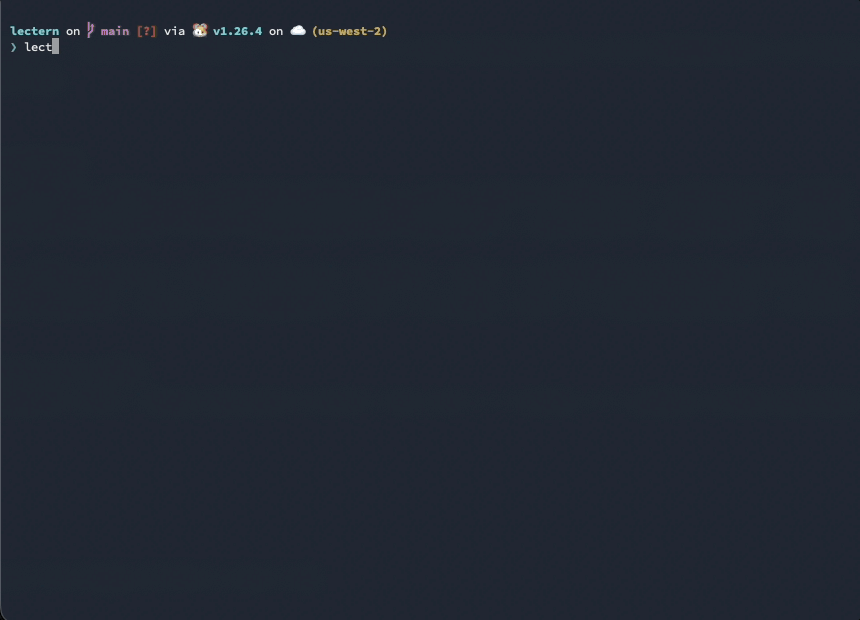

**[English](README.md)** | **Español**

# lectern

<p align="center">
  <a href="https://github.com/danshort/lectern/actions/workflows/ci.yml"></a>
  <a href="https://github.com/danshort/lectern/releases"></a>
  <a href="go.mod"></a>
  <a href="https://goreportcard.com/report/github.com/danshort/lectern"></a>
  <a href="LICENSE"></a>
  <a href="https://github.com/danshort/lectern/issues"></a>
  <a href="https://github.com/openspec"></a>
</p>

Interfaz de terminal controlada por teclado para leer y navegar artefactos de proyectos [OpenSpec](https://github.com/openspec) — propuestas, diseños, specs y tareas.

> **lectern es un fork de [dossier](https://github.com/fselich/dossier) de [fselich](https://github.com/fselich).** Se renombró a medida que diverge y se mantiene de forma independiente. Todo el crédito de la herramienta original es del autor upstream; consulta [LICENSE](LICENSE).

> Desarrollado con OpenSpec. Este repositorio contiene 12 archivos de spec de proyecto y más de 20 cambios archivados que documentan el historial completo de desarrollo de la herramienta.

<p align="center">
  
</p>

---

## Funcionalidades

- Navega todos los cambios activos y sus artefactos desde una única interfaz
- Renderiza Markdown con resaltado de sintaxis completo
- Alterna casillas de verificación (`- [ ]` / `- [x]`) en el propio archivo `tasks.md`
- Recarga en vivo ante cambios en disco (sondeo cada 500 ms)
- Abre cualquier artefacto en `$EDITOR`
- Muestra una superposición con los atajos de teclado desde cualquier pantalla con `?`
- Inspecciona en una vista de solo lectura cada worktree de git del repositorio, con los cambios activos de cada uno y su progreso de tareas en vivo
- Acepta una ruta como argumento para ver un cambio concreto sin necesitar un proyecto completo

---

## Instalación

**Requisitos:** terminal con soporte de color ANSI. Go 1.25 o posterior si compilas desde el código fuente.

```bash
# Homebrew
brew tap danshort/tap
brew trust danshort/tap   # una vez: Homebrew requiere confiar en taps de terceros
brew install lectern

# Desde el código fuente
git clone https://github.com/danshort/lectern
cd lectern
make build    # genera ./lectern
make install  # instala mediante go install

# Usando go install
go install github.com/danshort/lectern/cmd/lectern@latest
```

¿Quieres trabajar en lectern? Consulta [DEVELOPING.md](DEVELOPING.md) para compilar
y ejecutar una versión de desarrollo junto a tu copia instalada.

---

## Uso

Ejecutar desde la raíz de un proyecto OpenSpec:

```bash
lectern
```

Ver un directorio de cambio concreto por ruta:

```bash
lectern /ruta/a/openspec/changes/mi-cambio
```

### Referencia de teclado

Pulsa `?` en cualquier pantalla para abrir una superposición con estos atajos, agrupados por pantalla. Pulsa `?`, `Esc` o `q` para cerrarla.

#### Modo normal (viendo un cambio)

| Tecla | Acción |
|---|---|
| `h` / `l` | Cambio anterior / siguiente |
| `1` | Pestaña de propuesta |
| `2` | Pestaña de diseño |
| `3` | Pestaña de specs (pulsando de nuevo se cicla entre varios archivos) |
| `4` | Pestaña de tareas |
| `Tab` / `Shift+Tab` | Pestaña siguiente / anterior |
| `←` / `→` | Pestaña anterior / siguiente (equivale a `Shift+Tab` / `Tab`) |
| `j` / `↓` | Desplazar hacia abajo (o mover cursor de tareas hacia abajo) |
| `k` / `↑` | Desplazar hacia arriba (o mover cursor de tareas hacia arriba) |
| `Space` | Alternar tarea bajo el cursor (solo en pestaña de tareas) |
| `e` | Abrir artefacto en `$EDITOR` |
| `i` | Abrir la vista de configuración del proyecto |
| `a` / `Esc` | Entrar en modo índice |
| `?` | Alternar la ayuda de atajos de teclado |
| `q` / `Ctrl+C` | Salir |

#### Modo índice (navegador de cambios y specs)

| Tecla | Acción |
|---|---|
| `j` / `↓` | Mover cursor hacia abajo |
| `k` / `↑` | Mover cursor hacia arriba |
| `Enter` | Abrir el cambio, spec o cambio archivado seleccionado |
| `Space` | Expandir / contraer una spec de proyecto |
| `/` | Filtrar la lista (escribe para acotar; `Enter` confirma, `Esc` cancela) |
| `s` | Alternar el orden de las specs (por nombre / por sufijo) |
| `w` | Abrir la vista de worktrees |
| `i` | Abrir la vista de configuración del proyecto |
| `?` | Alternar la ayuda de atajos de teclado |
| `Esc` | Limpiar el filtro activo; si no hay, salir |
| `q` / `Ctrl+C` | Salir |

#### Modo worktrees (resumen entre worktrees)

Inspecciona los worktrees de git del repositorio actual — útil cuando varios
agentes trabajan en worktrees hermanos a la vez. Cada worktree aparece con su rama
(o un SHA corto de HEAD cuando está en HEAD desacoplado) y sus cambios activos con
el progreso de tareas en vivo; el worktree actual se muestra primero con la
insignia `(current)`. Los cambios ajenos se abren en **solo lectura** (no se pueden
marcar tareas ni editar in situ); `e` sigue abriendo el artefacto en `$EDITOR`.
Requiere `git` en el `PATH` — de lo contrario la vista muestra una única línea de
"no disponible".

| Tecla | Acción |
|---|---|
| `j` / `k` | Mover cursor hacia abajo / arriba |
| `Enter` | Abrir el cambio seleccionado en solo lectura |
| `e` | Abrir artefacto en `$EDITOR` |
| `?` | Alternar la ayuda de atajos de teclado |
| `a` / `Esc` | Volver al índice |
| `q` / `Ctrl+C` | Salir |

#### Modo archivo (viendo un cambio archivado)

| Tecla | Acción |
|---|---|
| `1`–`4` | Cambiar pestaña de artefacto |
| `Tab` / `Shift+Tab` / `←` / `→` | Ciclar entre pestañas de artefacto |
| `j` / `k` | Desplazar |
| `e` | Abrir artefacto en `$EDITOR` |
| `i` | Abrir la vista de configuración del proyecto |
| `a` / `Esc` | Volver al índice |
| `?` | Alternar la ayuda de atajos de teclado |
| `q` / `Ctrl+C` | Salir |

#### Modo visor de spec

| Tecla | Acción |
|---|---|
| `j` / `k` | Desplazar |
| `e` | Abrir spec en `$EDITOR` |
| `Esc` | Volver al índice |
| `?` | Alternar la ayuda de atajos de teclado |
| `q` / `Ctrl+C` | Salir |

En modo foco de requisitos:

| Tecla | Acción |
|---|---|
| `h` / `l` | Requisito anterior / siguiente |
| `j` / `k` | Desplazar |
| `e` | Abrir spec en `$EDITOR` |
| `Esc` | Volver al índice |
| `?` | Alternar la ayuda de atajos de teclado |
| `q` / `Ctrl+C` | Salir |

#### Vista de configuración del proyecto

| Tecla | Acción |
|---|---|
| `j` / `k` | Desplazar |
| `i` / `Esc` | Volver a la pantalla anterior |
| `?` | Alternar la ayuda de atajos de teclado |
| `q` / `Ctrl+C` | Salir |

---

## Estructura de proyecto

lectern espera un directorio `openspec/` en la raíz del proyecto:

```
openspec/
├── changes/
│   ├── <nombre-cambio>/
│   │   ├── .openspec.yaml   # Requerido: identifica el directorio como un cambio
│   │   ├── proposal.md
│   │   ├── design.md
│   │   ├── tasks.md         # Sintaxis de casillas GFM: - [ ] / - [x]
│   │   └── specs/
│   │       └── <nombre-spec>/
│   │           └── spec.md
│   └── archive/
│       └── YYYY-MM-DD-<nombre>/
└── specs/
    └── <nombre-spec>/
        └── spec.md          # Requisitos detectados por: ### Requirement: <nombre>
```
